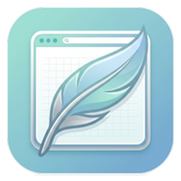

# 🌐 Lite Browser

<p align="center">
  
</p>

<p align="center">
  <b>Chromium Embedded Framework (CEF 151.3.24 / Chromium 134.0.6998.36) 순수 Win32 C CAPI 기반의 초경량·고성능 하이브리드 웹 브라우저</b>
</p>

<p align="center">
  <a href="https://github.com/gregoryyoon/lite_browser"></a>
  <a href="https://github.com/gregoryyoon/lite_browser"></a>
  <a href="https://github.com/gregoryyoon/lite_browser"></a>
  <a href="https://github.com/gregoryyoon/lite_browser"></a>
  <a href="https://github.com/gregoryyoon/lite_browser"></a>
  <a href="https://github.com/gregoryyoon/lite_browser"></a>
  <a href="https://github.com/gregoryyoon/lite_browser"></a>
  <a href="https://github.com/gregoryyoon/lite_browser"></a>
  <a href="LICENSE"></a>
</p>

---

## 📌 개요 (Overview)

**Lite Browser**는 C++ 런타임 추상화, 스마트 포인터 및 묵직한 프레임워크 클래스에 의존하지 않고, **순수 C 언어(C11)**로 작성된 CEF (Chromium Embedded Framework) C API와 Windows Win32 Native API를 직결하여 초고속 시동 속도와 극상의 메모리 효율을 달성한 64-bit 하이브리드 데스크톱 웹 브라우저입니다.

HTML5/CSS3/JavaScript 기반의 현대적 **벤토 그리드(Bento Grid) 웹 UI**와 순수 Win32 기반의 **멀티 브라우저 HWND 임베딩 아키텍처**를 결합하여, **듀얼 화면 분할(Split-View)**, **실시간 탭 분리(Reparenting)**, **Windows 10/11 기본 브라우저 연동 및 전용 설정 대시보드(`lite://settings`)**, **성능 모드 전환(실행 속도 우선 vs 메모리 절감 우선)**, **스마트 북마크/지능형 옴니박스 UX(`lite://favorites`)**, **다운로드 관리자(`lite://downloads`)**, 그리고 **독립 도킹 AI 에이전트 사이드패널**을 제공합니다.

---

## ✨ 핵심 특징 (Key Features)

### 1. ⚡ Pure C11 C API 기반의 마이크로 모듈러 아키텍처
- C++ 클래스 상속 및 STL 의존성을 완전히 배제하고, **순수 C11 C API**만으로 CEF 이벤트 콜백 매핑 및 정밀 수동 참조 카운트(`add_ref` / `release`), C11 표준 원자적 연산(`stdatomic.h`)을 제어합니다.
- `GWLP_USERDATA`와 구조체 동적 할당(`browser_window_t`)을 활용한 안전한 멀티 윈도우/다중 탭 격리를 구현했습니다.
- `WM_DESTROY` 수신 시 메모리를 조기 해제하지 않고, 자식 UI 브라우저 및 모든 탭 브라우저들의 비동기 소멸 콜백(`on_before_close`)이 100% 완료된 시점에만 메모리를 해제하는 **비동기 수명 주기 격리 가드**로 Use-After-Free(UAF) 크래시를 원천 차단했습니다.

### 2. 🗂️ 다중 탭 (Multi-Tab) 관리, 균등 비율 축소 & 실시간 탭 분리 (Reparenting)
- **Chrome/Edge 스타일 균등 축소**: 탭이 늘어나면 `flex: 1 1 0px` 및 `min-width: 32px`로 전 탭의 폭이 균등하게 자동 축소되며, Container Queries(`@container (max-width: 75px)`)로 닫기 버튼이 부드럽게 자동 숨김 처리됩니다.
- **활성 탭 기준 상대 위치 새 탭 삽입**: 새 탭 생성 시 맨 끝에 추가되지 않고 현재 보고 있는 탭의 바로 오른쪽(`active_tab_index + 1`) 슬롯에 즉시 삽입되어 자연스러운 탐색 흐름을 유지합니다.
- **새로고침 없는 탭 분리(Reparenting)**: `PointerEvent`의 **`setPointerCapture`**를 채택하여 탭을 윈도우 밖으로 드래그할 때 OS 드롭 제한 기호(🚫)를 우회하고, 마우스를 놓는 즉시 새 창을 생성한 뒤 Win32 `SetParent` API를 통해 네이티브 콘텐츠 브라우저 HWND를 리로드 없이 실시간 이관합니다.
- **HWND Z-order 잔상 차단**: 탭 전환 시 비활성 탭들의 HWND를 명시적으로 `ShowWindow(SW_HIDE)` 처리하고 활성 탭만 `ShowWindow(SW_SHOW)`하여 브라우저 전환 시 겹침 현상과 잔상을 완벽히 방지합니다.

### 3. ◫ 듀얼 화면 분할 (Dual Split-View Multitasking)
- 단일 탭 내에서 좌/우 2개의 독립된 웹 브라우저 인스턴스를 동시 렌더링하여 효율적인 멀티태스킹을 지원합니다.
- 4px 마우스 리사이저 바 호버 시 리사이즈 커서(↔)로 전환되며, `0.2f` ~ `0.8f` 가변 비율로 화면을 자유롭게 조절할 수 있습니다.
- CEF 포커스 핸들러(`cef_focus_handler_t`)와 Win32 `WM_MOUSEACTIVATE` 센서를 연동하여 현재 선택된 뷰의 URL, 제목, 탐색 상태가 상단 단일 주소창과 완벽히 동기화되며, 선택된 화면에 **Edge 스타일의 2px 블루 직각 선택 보더(`RGB(0, 102, 204)`)**가 즉각 표시됩니다.
- 분할 탭 내부 링크 클릭이나 팝업 시 새 탭을 강제 생성하지 않고 클릭이 발생한 해당 분할 화면 내에서 직접 이동합니다.
- 웹페이지 링크 우클릭 컨텍스트 메뉴에서 "다른 분할 화면에서 열기"를 지원합니다.

### 4. 🍱 벤토 그리드(Bento Grid) 테마 시스템 & Win32 다크/라이트 모드 실시간 동기화
- 설정(`lite://settings`), 북마크(`lite://favorites`), 다운로드(`lite://downloads`), AI 사이드패널 등 모든 내부 대시보드에 정보 밀도와 심미성을 극대화한 **벤토 그리드(Bento Grid)** 카드 UI를 전면 도입했습니다.
- `:root`(라이트 모드)와 `[data-theme="dark"]`(다크 모드) 기반의 체계적인 CSS 토큰 시스템을 구축하고, `BroadcastChannel` 및 C 백엔드 IPC를 통해 열려 있는 모든 창과 탭에 테마를 실시간 전파합니다.
- **화이트 플래시(White Flash) 원천 차단**: Win32 `CreateWindowEx` 배경 브러시 분기(`RGB(13, 15, 21)` vs `RGB(228, 228, 231)`), `WM_ERASEBKGND` 동적 처리, 클래스 브러시 갱신(`SetClassLongPtrW`), DWM 다크 모드(`DWMWA_USE_IMMERSIVE_DARK_MODE`) 연동을 완료했습니다.
- **인라인 Lucide SVG 표준화**: 외부 폰트나 CDN 의존 없이 단독 오프라인 구동이 가능한 순수 인라인 **Lucide SVG(`viewBox="0 0 24 24"`, `stroke="currentColor"`)**를 전면 적용하여 이모지 문자를 완전히 배제했습니다.
- **리스트 단일행 말줄임표 불변식**: 테이블 및 카드 컴포넌트에 고정 너비 레이아웃과 `white-space: nowrap; overflow: hidden; text-overflow: ellipsis;`를 적용하여 텍스트 길이에 관계없이 레이아웃이 항상 단정하게 정돈됩니다.

### 5. ⚙️ 전용 설정 대시보드 (`lite://settings`) & Windows 기본 브라우저 연동
- 주소창 `lite://settings` 입력 또는 상단 3점 메뉴 [설정] 클릭으로 직관적인 전용 설정 페이지에 접속할 수 있습니다.
- **Windows 10/11 기본 브라우저 원클릭 연동**:
  - Windows 레지스트리(`HKCU\Software\Classes\LiteBrowserHTML`, `StartMenuInternet`, `Capabilities`, `URLAssociations`, `FileAssociations`) 표준 등록 엔진(`default_browser.c`) 탑재.
  - 클릭 한 번으로 Windows 기본 앱 설정 창(`ms-settings:defaultapps`)을 자동 팝업.
  - Windows 설정에서 기본 브라우저를 변경하고 브라우저로 돌아오면(`focus`, `visibilitychange`), 새로고침 없이도 **실시간 상태 배지(`기본 브라우저로 설정됨` / `기본 브라우저 아님`)**가 즉시 자동 갱신(Auto-Refresh)됩니다.
- **엔진 제원 명시**: 브라우저 버전(1.0.0 64-bit), CEF 런타임(151.3.24), Chromium 엔진(134.0.6998.36), 아키텍처(Pure Win32 C CAPI) 상세 표출.

### 6. 🚀 런타임 성능 모드 전환 & 빌드 타임 ThinLTO / LTCG 최적화
- **사용자 맞춤 런타임 성능 모드 (`lite://settings`)**:
  - **실행 속도 우선 (Speed Priority - 기본값)**: GPU 하드웨어 가속(`--enable-gpu`), 타일 메모리 복사 단축(`--enable-zero-copy`), Direct3D 래스터화(`--enable-gpu-rasterization`)로 초고속 렌더링 제공.
  - **메모리 절감 우선 (Memory Saver Priority)**: 무조건적 도메인 격리를 축소(`--disable-site-isolation-trials`), 최대 렌더러 프로세스를 2개로 엄격 제한(`--renderer-process-limit=2`), V8 JS 힙 상한 256MB 제한(`--js-flags="--max-old-space-size=256"`), 백그라운드 절전(`MemorySaverMode`), 확장 기능 비활성화(`--disable-extensions`)를 활성화하여 저사양 PC에서 RAM 점유율을 30~50% 대폭 절감.
  - 설정 영속화(`%USERPROFILE%\.lite-browser\optimization_mode.txt`) 및 **원클릭 클린 재시작 엔진 (`restart_browser_application`)**을 탑재하여 모든 창에 `WM_CLOSE`를 전송, CEF 캐시 락을 안전하게 해제한 후 신규 인스턴스를 무결하게 기동합니다.
- **빌드 타임 ThinLTO / LTCG 최적화**:
  - Release 빌드 시 MSVC 컴파일러/링커의 전체 프로그램 최적화(`/GL`), 링크 타임 코드 생성(`/LTCG`), 최대 속도 최적화(`/O2`, `/Oi`, `/Ot`), 함수 레벨 링크(`/Gy`), 문자열 풀링(`/GF`), 중복 COMDAT 제거(`/OPT:REF`, `/OPT:ICF`)를 적용하여 릴리즈 바이너리의 실행 성능을 극대화했습니다.

### 7. 🛡️ 독립 캐시 격리 및 싱글톤 안전성 (Isolated Cache & Singleton Safety)
- `settings.root_cache_path`를 `%LOCALAPPDATA%\LiteBrowser\User Data`로 명시 분리 지정하여, 기본 CEF 임시 캐시 디렉터리 공유로 인한 프로세스 싱글톤 락 충돌 및 프로필 손상 위험을 원천 해소했습니다.

### 8. 🎨 리마스터 100% 알파 투명 HiDPI 아이콘 & 윈도우 셸 연동
- 흰색 사각 배경을 제거한 **100% 알파 투명 배경** 및 부드러운 소프트 섀도우를 결합한 모던 둥근 타일(Squircle) 아이콘을 적용했습니다.
- Windows 표준 5개 해상도(`16x16`, `24x24`, `32x32`, `48x48`, `256x256`)를 단일 ICO 파일([`cefsimple.ico`](cef_binary_151.3.24/tests/cefsimple_capi/win/cefsimple.ico))로 통합 번들링하고, 탐색기 소형 뷰(16x16, 24x24)를 픽셀 단위로 선명화(Pixel-fitted)했습니다.
- PE 리소스 주입 스크립트([`inject_icon.py`](cef_binary_151.3.24/tests/cefsimple_capi/win/inject_icon.py))를 통해 바이너리 내 구형 더미 아이콘을 제거하고 3개 그룹(`120`, `121`, `32512`)에 정밀 주입합니다.
- 빌드 후처리 및 인스톨러/언인스톨러 실행 시 `SHChangeNotify(SHCNE_ASSOCCHANGED, ...)`를 호출하여 재부팅 없이도 Windows 셸 아이콘 캐시를 즉시 갱신합니다.

### 9. 🔒 보안 메타데이터 및 Authenticode 전자서명 파이프라인 (Code Signing)
- 배포 인스톨러 바이너리에 정식 PE 버전 및 제작사 메타데이터(`ProductName`, `CompanyName`, `LegalCopyright`, `FileVersion`)를 탑재했습니다.
- 원클릭 코드 서명 스크립트([`scripts/sign_installer.ps1`](scripts/sign_installer.ps1))를 통해 SHA-256 인증서 및 **DigiCert RFC 3161 공인 타임스탬프(`http://timestamp.digicert.com`)**를 적용하여 인증서 만료 후에도 서명이 영구 유효하도록 보장합니다.
- **CEF 무결성 검증 규칙 준수**: CEF Bootstrap의 `IsUnsignedOrValid()` 규칙에 따라 내부 바이너리는 무서명 상태를 유지하여 자체 서명으로 인한 `__debugbreak()`(0x800B0109) 충돌을 방지하고, 최종 배포 인스톨러(`LiteBrowserInstaller.exe`)에 전자서명을 적용하여 Microsoft SmartScreen 및 백신 신뢰도를 확보했습니다.

### 10. 📥 다운로드 관리자 대시보드 (`lite://downloads`)
- `%USERPROFILE%\Downloads` 고정 저장 및 동일 파일 존재 시 자동 순서 번호 부여(`filename (1).ext`)로 파일 덮어쓰기를 방지합니다.
- Chromium CEF 전역 Preference 제어로 브라우저 기본 다운로드 팝업 버블을 완전히 차단하고 조용한 백그라운드 다운로드를 수행합니다.
- 백엔드 푸시 IPC(`BroadcastDownloadUpdate`)를 통해 상단 툴바 원형 프로그레스 링(0%~100%) 및 완료 시 체크마크(✓) 펄스 인디케이터가 실시간 연동됩니다.
- 한글 및 공백/특수문자가 포함된 파일도 Windows Unicode API(`CheckFileExistsUtf8`)를 통해 파일 실존 여부를 100% 정합 판정합니다.

### 11. 🔖 지능형 옴니박스 & 차세대 북마크 대시보드 (`lite://favorites`)
- **맥락 추출 및 스마트 200자 요약 엔진 ([`ui/extractor.js`](ui/extractor.js))**: `iframe` 심층 탐색, UI 노이즈 필터링, 헤딩 가중치 기반 핵심 키워드 태그 5개 추출 및 중요도 점수 기반 본문 200자 요약을 자동 생성합니다.
- **스마트 옴니박스**: 주소창 입력 시 북마크(상단) ➔ 웹 검색 ➔ 방문 기록(하단) 통합 카드 렌더링, `#` 태그 검색 숏컷, 최근 30일 방문 빈도 및 최신성 2단계 정렬, 누적 방문 횟수(`👁️ N회 방문`) 실시간 카운트 표시.
- **북마크 대시보드 (`lite://favorites`)**: 타임라인 슬라이더, 태그 필터링, 카드/리스트 뷰 전환 및 드래그 텍스트 하이라이트 앵커 표출.

### 12. 🤖 독립 도킹 AI 사이드패널 & Windows DPAPI 보안 토큰 볼트
- 탭 전환이나 새 탭 생성 시에도 대화 세션이 단절되지 않고 상시 도킹을 유지하는 독립 네이티브 자식 브라우저(`win_ctx->sidepanel_browser`).
- **Chrome Gemini 스타일 5단계 본문 파싱**: YouTube 특화 초경량 Markdown 전처리(노이즈 및 댓글 원천 배제) 및 뷰포트 중심 본문 블록 추출.
- **다형성 AI Provider & 429 내결함성**: Gemini 3.7 Flash 기본 탑재, CoT 사고 과정(Thinking) 아코디언 스트리밍, 429 Rate Limit 발생 시 지수 백오프 자동 재시도(1.5초, 3.0초, 6.0초).
- **Windows DPAPI 보안 볼트 ([`simple_vault.c`](cef_binary_151.3.24/tests/cefsimple_capi/simple_vault.c))**: `CryptProtectData` 기반으로 `%USERPROFILE%\.lite-browser\vault.dat`에 사용자 자격증명을 OS 수준에서 안전하게 암호화 보관.

---

## 🏗️ 윈도우 레이아웃 및 아키텍처 (Architecture)

```text
+-----------------------------------------------------------------------------------------+
| Win32 Top-Level Window (Frameless, DWM Shadow, 0px Seamless Layout, Hit-Testing Subclass) |
|                                                                                         |
|  +-----------------------------------------------------------------------------------+  |
|  | [Top Child Browser] (Height: 72px * DPI Scale, Transparent Background)            |  |
|  | - Tab Bar: Multi-Tab, Auto-Shrinking, Relative Insertion, Drag-to-Separate       |  |
|  | - Navigation Bar: Back, Forward, Refresh, Omnibox, Split Button, Sidepanel Toggle |  |
|  +-----------------------------------------------------------------------------------+  |
|                                                                                         |
|  +-------------------------------------------------------------+-----+---------------+  |
|  | [Main Web Page / Split Left View]                           |     | [Docked AI    |  |
|  | (0px Seamless Fit / 2px Blue Selection Border in Split)     | 4px |  Sidepanel]   |  |
|  |                                                             | Res | (Independent  |  |
|  | ----------------- (4px Splitter Bar) ---------------------  | izer|  Native HWND, |  |
|  |                                                             | Bar |  Bento Chat & |  |
|  | [Split Right View (Optional)]                               |     |  DPAPI Vault) |  |
|  | (Edge-Style Rectangular Border, Shared Omnibox Sync)        |     |               |  |
|  +-------------------------------------------------------------+-----+---------------+  |
+-----------------------------------------------------------------------------------------+
```

---

## 🛠️ 기술 스택 (Tech Stack)

| 계층 (Layer) | 구성 요소 (Components) | 세부 기술 사양 (Specification) |
| :--- | :--- | :--- |
| **코어 브라우저 엔진** | CEF (Chromium Embedded Framework) | **CEF 151.3.24** (Chromium 134.0.6998.36), Pure C CAPI (`cefsimple_capi`) |
| **시스템 백엔드 언어** | C 언어 (MSVC Compiler) | **C11** (`/std:c11`, `/experimental:c11atomics`), Pure Win32 API, GDI, DWM |
| **빌드 최적화 (LTO)** | MSVC Whole Program Optimization | `/GL`, `/LTCG`, `/O2`, `/Oi`, `/Ot`, `/Gy`, `/GF`, `/OPT:REF`, `/OPT:ICF` |
| **보안 & 암호화** | Windows Security APIs | **Windows DPAPI** (`CryptProtectData`), Authenticode **SHA-256 + RFC 3161 Timestamp** |
| **윈도우 셸 연동** | Windows Shell APIs | `SHCNE_ASSOCCHANGED`, `GetUserDefaultLocaleName`, Registry Capabilities / ProgID |
| **웹 프론트엔드 UI** | Chrome Controls & Dashboards | **HTML5, Vanilla CSS3 (Bento Grid Tokens), ES6+ JavaScript, Inline Lucide SVG** |
| **빌드 시스템** | CMake & Visual Studio | CMake 3.19+, Visual Studio 2022/2026 MSVC C/C++ x64 |
| **배포 패키징 도구** | NSIS (Nullsoft Scriptable Install System) | NSIS 3.x 64-bit Unicode (`$PROGRAMFILES64\LiteBrowser`) |

---

## 🚀 빌드 및 실행 가이드 (Build & Packaging)

### 1. 전제 조건 (Prerequisites)
- **OS**: Windows 10 또는 Windows 11 64-bit
- **컴파일러**: Visual Studio 2022 또는 2026 (C/C++ MSVC v143+ x64 툴셋)
- **빌드 도구**: CMake 3.19 이상
- **스크립트 런타임**: Python 3.8+ (아이콘 바이너리 리소스 주입용), PowerShell 5.1+
- **패키징 도구 (선택)**: NSIS 3.x (인스톨러 생성 시 필요)
- **코드 서명 도구 (선택)**: Windows 10/11 SDK (`signtool.exe`)

---

### 2. 컴파일 및 빌드 (Debug / Release)

PowerShell 터미널에서 프로젝트 루트 디렉터리를 기준으로 아래 명령어를 실행합니다:

```powershell
# 1) Debug 모드 빌드 (개발 및 디버깅용 - 빠른 증분 컴파일)
cmake --build cef_binary_151.3.24\build --config Debug --target cefsimple_capi

# 2) Release 모드 빌드 (배포용 - Whole Program Optimization / LTCG 적용)
cmake --build cef_binary_151.3.24\build --config Release --target cefsimple_capi
```

빌드가 성공하면 실행 파일 및 의존 리소스가 아래 경로에 자동 생성 및 아이콘 주입됩니다:
- **Debug 바이너리**: `cef_binary_151.3.24\build\tests\cefsimple_capi\Debug\lite_browser.exe`
- **Release 바이너리**: `cef_binary_151.3.24\build\tests\cefsimple_capi\Release\lite_browser.exe`

---

### 3. NSIS 인스톨러 생성 & Authenticode 전자서명

독립 배포용 단일 설치 파일(`LiteBrowserInstaller.exe`)을 패키징하고 디지털 서명을 적용합니다:

```powershell
# Step 1: NSIS 인스톨러 컴파일
& "C:\Program Files (x86)\NSIS\makensis.exe" installer.nsi

# Step 2: Authenticode SHA-256 전자서명 및 DigiCert RFC 3161 공인 타임스탬프 적용
powershell -ExecutionPolicy Bypass -File scripts\sign_installer.ps1
```

- **최종 결과물**: `LiteBrowserInstaller.exe` (~180MB, Authenticode 디지털 서명 탑재)

---

## 📂 프로젝트 구조 (Project Structure)

```text
lite_browser\
├── README.md                                  # GitHub 프로젝트 대표 안내 문서
├── LICENSE                                    # BSD 3-Clause 오픈소스 라이선스
├── installer.nsi                              # NSIS 64-bit 인스톨러 패키징 스크립트
├── scripts\                                   # 자동화 및 빌드 보조 스크립트
│   ├── sign_installer.ps1                     # signtool 기반 SHA-256 + DigiCert RFC 3161 코드 서명기
│   └── certs\                                 # 코드 서명 인증서 디렉터리 (.gitignore 대상)
├── ui\                                        # HTML5 / CSS3 / Vanilla JS 벤토 그리드 UI 에셋
│   ├── index.html / style.css / app.js        # 상단 프레임리스 탭바 & 지능형 주소창 컨트롤 UI
│   ├── settings.html / css / js               # lite://settings 전용 설정 대시보드
│   ├── manager.html / css / js                # lite://favorites 차세대 북마크 대시보드
│   ├── downloads.html / css / js              # lite://downloads 다운로드 관리자 대시보드
│   ├── sidepanel.html / css / js              # 독립 도킹 AI 에이전트 사이드패널 UI
│   ├── theme.js                               # 벤토 그리드 다크/라이트/시스템 테마 전역 브로드캐스트 엔진
│   ├── extractor.js                           # 웹페이지 중요도 점수 기반 본문 200자 요약기
│   ├── content_extractor.js                   # Chrome Gemini 스타일 5단계 본문/YouTube 마크다운 파서
│   ├── ai_providers.js                        # 다형성 AI 어댑터 (Gemini 3.7 Flash, 429 지수 백오프)
│   ├── agent_memory.js                        # AI 에이전트 세션 메모리 관리
│   └── task_runtime.js                        # 자율 브라우저 동작 제어 런타임
├── cef_binary_151.3.24\                       # CEF 151.3.24 바이너리 배포본 (Chromium 134.0.6998.36)
│   └── tests\cefsimple_capi\                  # 순수 C11 C API 메인 백엔드 소스 디렉터리
│       ├── CMakeLists.txt                     # C11 타깃 빌드, LTCG 최적화 및 후처리 파이프라인
│       ├── cefsimple_win.c                    # Win32 메인 진입점 (wWinMain), 로캘 감지, root_cache 격리
│       ├── default_browser.c / h              # Windows 10/11 기본 브라우저 레지스트리 등록 및 제어
│       ├── simple_optimization.c / h          # 속도 우선 vs 메모리 절감 런타임 최적화 모드 엔진
│       ├── simple_app.c / h                   # Win32 메인 프로시저, 서브클래싱, 0px 심리스 레이아웃
│       ├── simple_handler.c / h               # IPC 액션 라우터, 탭 전환/생성, 옴니박스 동기화
│       ├── simple_life_span_handler.c         # 팝업 가로채기, 비동기 소멸 UAF 방지 가드
│       ├── simple_download_handler.c / h      # CEF 다운로드 추적, 중복 순서 부여, JSON 영속화
│       ├── simple_vault.c / h                 # Windows DPAPI (CryptProtectData) 보안 볼트
│       ├── browser_context.h                  # 윈도우/탭/분할화면 동적 컨텍스트 구조체 정의
│       └── win\
│           ├── cefsimple.ico / small.ico      # 100% 알파 투명 5개 해상도 HiDPI 아이콘 리소스
│           └── inject_icon.py                 # Win32 Resource API 기반 PE 리소스 자동 주입기
└── docs\                                      # 상세 기술 및 아키텍처 문서
    ├── logo.png                               # 256x256 HiDPI 투명 브라우저 로고 에셋
    ├── prompt.md                              # 아키텍처 사양 및 제약 사항 문서
    └── walkthrough.md                         # 전체 기능 및 마일스톤 통합 기술 보고서 (Walkthrough)
```

---

## 📄 라이선스 (License)

본 프로젝트는 Chromium 및 CEF (Chromium Embedded Framework) 오픈소스 라이선스 규정을 준수합니다.

- **Chromium / CEF**: [BSD 3-Clause License](https://opensource.org/licenses/BSD-3-Clause)
- **Lite Browser Source Code**: Copyright (C) 2026 Gregory Yoon. All rights reserved.
- 자세한 라이선스 조항은 [`LICENSE`](LICENSE) 및 [`cef_binary_151.3.24/LICENSE.txt`](cef_binary_151.3.24/LICENSE.txt)를 참조하십시오.
