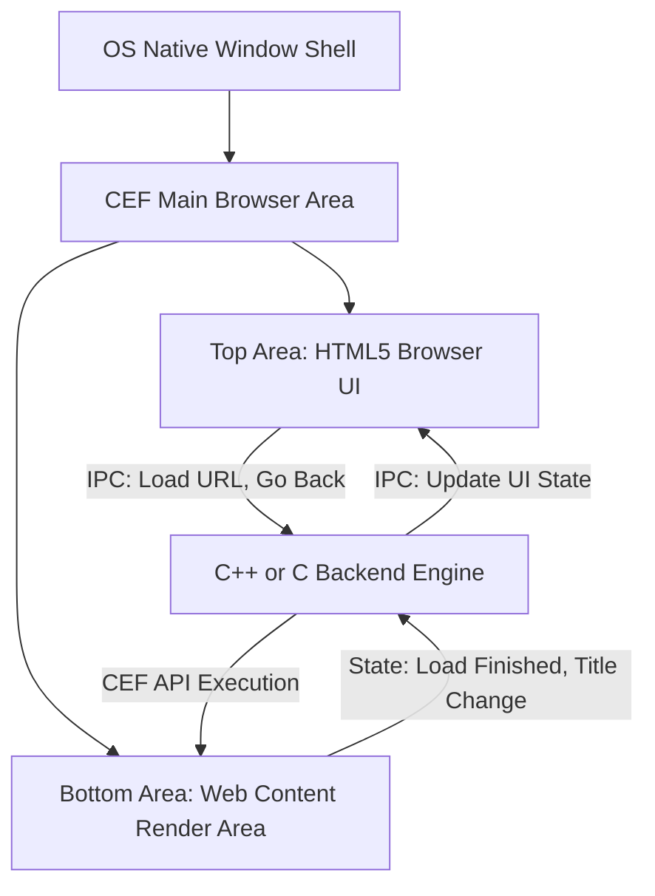

# 네이티브 윈도우 모드 GUI 분석 및 HTML5 기반 UI 설계 타당성 보고서

본 보고서는 `cefsimple_capi` 예제를 `--use-native` (네이티브 윈도우 모드) 옵션으로 실행할 때의 GUI 구성 요소를 정밀 분석하고, 크롬의 핵심 기능 구현 시 네이티브 방식과 HTML5 기반 UI 방식 중 어떤 것이 기술적 및 아키텍처 관점에서 우수한지 검증한 보고서입니다.

---

## 1. 네이티브 윈도우 모드 (`--use-native`) GUI 구성 요소 정밀 분석

`--use-native` 옵션을 활성화하면 CEF는 플랫폼별 네이티브 창 제어 방식(Windows의 경우 Win32 API)을 사용하여 브라우저 창을 생성합니다. 

### GUI 구성 요소 및 한계
- **자동 생성되는 컨트롤 없음**: 네이티브 모드로 실행하더라도 CEF는 타이틀 바와 창 경계선(Window Frame)을 제외하면 **어떤 네이티브 메뉴, 주소창, 탐색 버튼(뒤로가기/새로고침 등)도 자동으로 생성하지 않습니다**.
- **단일 브라우저 뷰 구조**: 최상위 네이티브 윈도우 창이 생성된 후, 그 창의 클라이언트 영역(Client Area) 전체를 꽉 채우는 단 하나의 브라우저 렌더러 창(자식 창)이 생성됩니다.
- **외관상의 결과**: 결국 기본 상태(Views 프레임워크 모드)와 동일하게 **아무런 조작 도구가 없는 빈 웹페이지 화면만 렌더링**됩니다.

### 네이티브 윈도우 모드에서 Chrome GUI 기능을 구현하는 방식
만약 이 모드에서 크롬처럼 주소창과 버튼들을 네이티브로 구현하려면 다음과 같은 복잡한 Win32 GUI 프로그래밍을 직접 수행해야 합니다.

1. **커스텀 부모 창 생성**: CEF가 최상위 창을 직접 만들게 하는 대신, 개발자가 직접 Win32 API(`CreateWindowEx`)를 호출하여 메인 부모 창을 생성하고 `WndProc` 메시지 루프를 작성합니다.
2. **네이티브 자식 컨트롤 배치**: 부모 창 상단에 Win32 표준 컨트롤인 `BUTTON` 클래스(뒤로가기, 앞으로가기, 새로고침용)와 `EDIT`/`COMBOBOX` 클래스(주소창용)를 자식 창으로 직접 생성하여 배치합니다.
3. **CEF 브라우저 영역 제한**: `cef_browser_host_create_browser` 호출 시 `window_info.parent_window`에 메인 부모 창의 핸들(`HWND`)을 지정하고, `window_info.bounds` 영역을 주소창 아랫부분(예: 상단 80픽셀을 제외한 나머지 영역)으로 제한하여 브라우저가 하단에만 띄워지도록 설정합니다.
4. **크기 변경 및 메시지 전파**: 메인 창의 크기가 바뀔 때 발생하는 `WM_SIZE` 메시지를 받아 주소창의 너비를 조절하고 브라우저 창의 크기를 재계산하여 `MoveWindow`를 호출해 주는 레이아웃 관리 코드를 직접 작성해야 합니다.

---

## 2. 네이티브 GUI 방식 vs HTML5 기반 UI 방식 비교 분석

네이티브 모드에서 OS API로 주소창과 버튼을 그리는 방식과, 화면 전체를 CEF 브라우저로 채우고 그 위에서 HTML5로 UI를 렌더링하는 방식을 다각도로 비교해 보았습니다.

### 1) GUI 디자인 및 UI/UX 디테일 (Aesthetics)
- **네이티브 GUI**: Win32 표준 컨트롤은 투박하고 1990년대 스타일의 회색 창을 벗어나기 힘듭니다. 둥근 모서리, 부드러운 호버 애니메이션, 그림자 효과, 그라데이션, 다크 모드 등을 지원하려면 모든 컨트롤의 그리기 로직(`WM_PAINT`, `WM_DRAWITEM`)을 개발자가 C 코드로 픽셀 단위로 직접 그리는 **오너 드로우(Owner-drawn) 기법**을 써야 하므로 개발 비용이 기하급수적으로 상승합니다.
- **HTML5 기반 UI**: **CSS3 표준(Flexbox, Grid, Transition 등)을 활용해 크롬 및 최신 모던 브라우저 수준의 디자인을 즉시 완성**할 수 있습니다. 마우스 호버 효과, 활성화 상태 디자인, 테마 변경(다크 모드/라이트 모드) 등을 CSS 스타일시트만으로 간단히 변경할 수 있어 심미성이 비교할 수 없이 우수합니다.

### 2) 크로스 플랫폼 지원 (Cross-Platform)
- **네이티브 GUI**: Windows용 Win32 C 코드, macOS용 Cocoa(Objective-C/Swift) 코드, Linux용 GTK C 코드를 **플랫폼별로 완전히 따로 구현**해야 합니다. 운영체제마다 윈도우 메시지 루프와 그래픽 처리 모델이 다르기 때문에 코드베이스가 3배로 늘어나고 관리가 불가능해집니다.
- **HTML5 기반 UI**: 한 번 작성된 HTML/CSS/JS 코드는 **모든 OS(Windows, macOS, Linux)의 CEF 내부 Chromium 엔진에서 완전히 동일하게 렌더링되고 동작**합니다. 백엔드 C 코드는 단지 OS별 빈 창만 열어주고 웹페이지를 띄워주는 역할만 하므로 이기종 플랫폼 이식이 매우 쉽습니다.

### 3) C API (`cefsimple_capi` 구조)에서의 메모리 및 개발 복잡도 (Simplicity)
- **네이티브 GUI**: 표준 컨트롤들의 핸들 관리, 메시지 가로채기(Subclassing), 단축키 처리, 포커스 이동 관리 등을 다수의 C 구조체와 함수 포인터 매핑으로 처리해야 합니다. C 언어의 특성상 객체지향적 컴포넌트 분리가 어려워 소스 코드가 순식간에 비대해지며, 윈도우 자원(GDI Brush, Font 등) 해제 누락으로 인한 시스템 리소스 누수 위험이 큽니다.
- **HTML5 기반 UI**: 백엔드 C 코드가 복잡한 창 배치나 그래픽 처리에 전혀 개입하지 않습니다. C 백엔드는 단지 **웹 UI(JS)와 연동되는 IPC 비동기 메시지 수신기** 역할만 수행하므로 코드의 복잡성이 획기적으로 줄어듭니다. 수동 참조 카운팅(`add_ref`, `release`)이 필요한 CEF 객체의 수가 최소화되어 메모리 관리 오류(Crash, Leak) 발생 가능성이 극도로 낮아집니다.

### 4) 확장성과 동적 레이아웃 제어 (Extensibility)
- **네이티브 GUI**: 다중 탭 기능(새 탭 추가 시 탭 크기 자동 조절, 드래그하여 탭 순서 변경 등)을 네이티브 코드로 구현하는 것은 마우스 드래그 좌표 계산 및 윈도우 재배치 로직이 들어가 복잡도가 상상을 초과합니다. 또한 북마크 바 숨김/보임 시의 부드러운 슬라이딩 효과 등도 네이티브에서는 구현하기 복잡합니다.
- **HTML5 기반 UI**: 이미 풍부하게 검증된 웹 컴포넌트나 드래그 앤 드롭 API(HTML5 Drag & Drop) 등을 사용해 탭 관리 기능을 단시간에 구현할 수 있으며, 북마크 바의 슬라이딩이나 사이드 패널 처리 등도 CSS Transition만으로 미려하게 해결됩니다.

---

## 3. 타당성 비교 분석 요약표

| 비교 항목 | 네이티브 GUI 방식 (Win32 API 등) | HTML5 기반 UI 방식 (추천) |
| :--- | :--- | :--- |
| **디자인 자유도** | ❌ 매우 낮음 (투박함, 디자인 커스텀 시 수만 줄의 C 렌더링 코드 필요) | 🟢 매우 높음 (CSS3 애니메이션, 테마 전환, 웹폰트 등 자유로운 스타일링 가능) |
| **크로스 플랫폼** | ❌ 불가능 (OS별 GUI 코드를 완전히 독립적으로 재작성해야 함) | 🟢 완벽 지원 (동일한 웹 소스코드로 모든 OS에서 100% 일치하는 UI 보장) |
| **C API 구현 난이도** | ❌ 최상 (메시지 루프 제어, 컨트롤 핸들 관리, 윈도우 서브클래싱 등 복잡) | 🟢 낮음 (C 코드는 IPC 메시지 처리 및 CEF 코어 API 제어에만 집중) |
| **레이아웃 제어** | ❌ 수동 코딩 (WM_SIZE 발생 시 수동으로 각 컨트롤 크기 재계산 및 배치) | 🟢 자동화 (CSS Flexbox, Grid 등으로 반응형 레이아웃 자동 구현) |
| **탭 및 확장 기능** | ❌ 직접 개발 불가 수준 (탭 드래그 앤 드롭, 동적 리스트 등을 네이티브 C로 짜기엔 너무 복잡) | 🟢 쉬움 (JS 드래그 앤 드롭 API 및 풍부한 오픈소스 라이브러리 활용 가능) |

---

## 4. 추천하는 HTML5 기반 UI 아키텍처 구성안

이 방식은 웹페이지 전체를 덮는 뼈대 브라우저 위에 브라우저 통제용 HTML/JS UI를 얹고, 실제 컨텐츠 웹페이지는 자식 뷰나 별도의 프레임으로 통제하는 하이브리드 아키텍처입니다.

1. **상하단 분할 렌더링 구조 (Multi-Browser Setup)**:
   - 하나의 메인 창 내부에 CEF 브라우저 인스턴스를 **2개** 생성합니다.
   - **UI 브라우저**: 상단(예: 높이 80px)에 고정 배치하고, 로컬 주소(`file:///ui/index.html`)를 로드하여 탭 바, 뒤로가기 버튼, 주소창 등을 표시합니다.
   - **콘텐츠 브라우저**: 나머지 하단 영역에 배치하고 사용자가 실제로 탐색하는 인터넷 웹페이지를 로드합니다.
2. **프로세스 간 통신 (IPC) 루프**:
   - 사용자가 **UI 브라우저**의 뒤로가기 버튼을 누르면, JS가 `window.cefQuery` 또는 프로세스 메시지를 통해 C 백엔드로 `"go_back"` 이벤트를 알립니다.
   - C 백엔드에서는 메시지를 받아 **콘텐츠 브라우저** 객체에 `browser->go_back(browser)`을 지시합니다.
   - **콘텐츠 브라우저**의 로딩 상태가 변하면 C 백엔드가 이를 감지하여 **UI 브라우저**로 현재 탐색 주소나 뒤로가기 가능 여부 등을 전송하여 UI를 실시간으로 동기화합니다.

따라서, `--use-native` 옵션을 사용하여 네이티브 윈도우 모드로 실행할 수 있는 역량이 있더라도, 현대적인 사용자 경험을 선사하고 개발 생산성을 높이기 위해서는 **HTML5 기반 UI 아키텍처를 적용하는 것이 비교할 수 없을 정도로 최선이자 압도적으로 유리한 선택**입니다.
